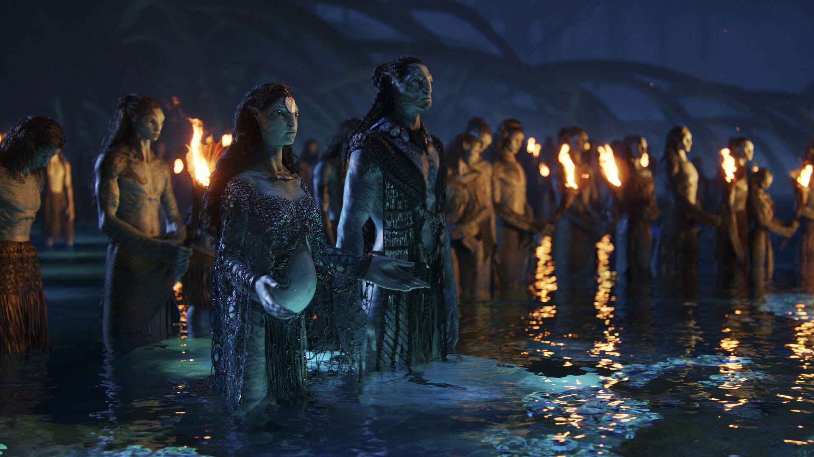

# Netflix UI clone (HTML & CSS)

1. Start by creating a blank HTML template
    
    html:5 + Tab

2. Add contents within the body

    ```html
    <body>
        <div>This is a div</div>
        <h1>This is a heading </h1>
        <p>This is a paragraph </p>
    </body>
    ```

3. Create a blue rectangle box

    ```html
    <div class="myBlueBox"></div>
    ```
    ```css
    body {
        margin: 0;
        padding: 0;
        font-family: Arial, Helvetica, sans-serif;
        background-color: #141414
    }
    .myBlueBox {
        height: 120px;
        width: 120px;
        background-color: aqua;
        margin: 10px;
    }
    ```


4. Create multiple blue boxes

    ```html
    <div class="myBlueBox"></div>
    <div class="myBlueBox"></div>
    <div class="myBlueBox"></div>
    ```

5. Add a container for the boxes and add a title on top

    ```html
    <h1>Row Title</h1>
    <div class="container">
        <div class="myBlueBox"></div>
        <div class="myBlueBox"></div>
        <div class="myBlueBox"></div>
    </div>
    ```
    ```css
    .container {
        display: flex;
    }
    ```

6. Add an outer container 

    ```html
    <div class="outer-container">
        <h1>Row Title</h1>
        <div class="container">
            <div class="myBlueBox"></div>
            <div class="myBlueBox"></div>
            <div class="myBlueBox"></div>
        </div>
    </div>
    ```
     ```css
    .outer-container {
        background-color: orange;
        display: flex;
        flex-direction: column;
    }
    ```

7. Rename the classes

    ```html
    <div class="row">
        <h1 class="row-title">Row Title</h1>
        <div class="row-posters">
            <div class="row-poster"></div>
            <div class="row-poster"></div>
            <div class="row-poster"></div>
        </div>
    </div>
    ```
    ```css
    .row-poster {
        height: 120px;
        width: 120px;
        background-color: aqua;
        margin: 10px;
    }
    .row-posters {
        display: flex;
        background-color: rebeccapurple;
    }
    .row {
        background-color: orange;
        display: flex;
        flex-direction: column;
        color: white
    }
    .row-title {
        color: white;
        font-size: 25px;
    }
    ```

<!-- creating an overall architecture -->

8. Try to create an overall architecture

    ```html
    <body>
        <p>Navbar</p>
        <p>Banner</p>
        <p>Nrt</p>
        <p>Navbar</p>
    </body>


9. Add the images with their styling

    ```html
    <div class="row">
        <h1 class="row-title">Netflix Originals</h1>
        <div class="row-posters">
            
            
            
            
            
            
        </div>
    </div>
    ```
    ```css
    .row {
        background-color: orange;
        display: flex;
        flex-direction: column;
    }
    .row-posters {
        display: flex;
        background-color: rebeccapurple;
        overflow-y: hidden;
        overflow-x: scroll;
    }

    .row-poster {
        max-height: 120px;
        width: 100%;
        margin: 7px;
        object-fit: contain;
    }
    ```

<!-- banner -->
10. Add an image for the banner and make it fullscreen

    ```html
    <div class="banner">
        Banner
    </div>
    ```
    ```css
    .banner {
    background-image:url('./images/banner_img.jpeg');
    background-size: cover;
    background-position: center center;
    object-fit: contain;
    height: 100vh;
    display: flex;
    align-items: center;
    }
    ```

11. Add the contents inside the banner

    ```html
    <div class="banner">
        <!-- Banner -->
        <div class="banner-contents">
            <h1>Banner title</h1>
            <div class="banner-buttons">
                <button>Play</button>
                <button>More Info</button>
            </div>
        </div>
    </div>
    ```
    ```css
    .banner-contents {
        display: flex;
        flex-direction: column;
        height: 190px;
        padding-left: 20px;
        position: absolute;
        top: 25%;
    }
    ```

12. Align the row a little above 

    ```css
    .row {
        display: flex;
        flex-direction: column;
        position: relative;
        top: -230px
    }
    ```

13. Add multiple rows and add a padding to the row

     ```css
    .row {
        display: flex;
        flex-direction: column;
        position: relative;
        top: -230px;
        padding: 35px;
    }
    ```

14. Add banner title and banner button styles

    ```html
     <div class="banner">
        <!-- Banner -->
        <div class="banner-contents">
            <h1 class="banner-title">Banner title</h1>
            <div class="banner-buttons">
                <button class="banner-button">Play</button>
                <button class="banner-button">More Info</button>
            </div>
        </div>
    </div>
    ```

    ```css
    .banner-title {
        font-size: 3.5rem;
        color: white;
    }
    .banner-buttons {
        display: flex;
    }
    .banner-button{
        cursor: pointer;
        color: white;
        outline: none;
        border: none;
        margin-left: 20px;
        text-align: center;
        font-weight: 700;
        border-radius: .2vw;
        padding-left: 2rem;
        padding-right: 2rem;
        margin-right: 1rem;
        padding-top: .5rem;
        padding-bottom: .5rem;
        background-color: rgba(51,51,51,.5);
        height: 40px;
        width: 35%
    }
    ```

15. Create the navbar 

    ```html
    <div class="nav" id="nav"> 
        
        <div class="nav-items">
            <h4 class="nav-item">Home</h4>
            <h4 class="nav-item">TV Shows</h4>
            <h4 class="nav-item">Movies</h4>

        </div>
    </div>
    ```
    ```css
    .nav {
        display: flex;
        position: fixed;
        width: 100%;
        align-items: center;
        z-index: 4;
        color: white
    }
    .logo {
        width: 120px;
        max-height: 34px;
        margin-left: 12px;
        margin-right: 35px;
    }
    .nav-items {
        display: flex;
    }

    .nav-item {
        margin-right: 12px;
    }
    ```


    

